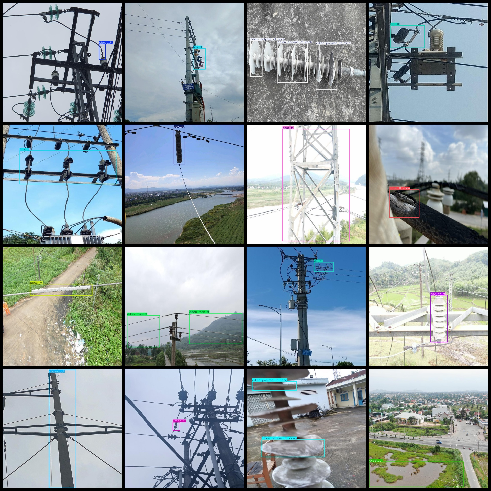
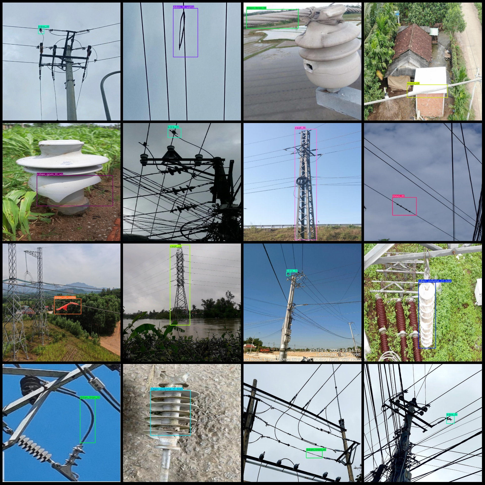

# Power Equipment Intelligent Inspection Data for Circuit Breaker, Cable Insulation and Fault Detection in Electric Power Scenarios

Dataset format: Pascal VOC format + YOLO format (txt files without split paths, only containing jpg images and corresponding VOC format xml files and YOLO format txt files)
Number of images (jpg file count): 5976
Number of annotations (xml file count): 5976
Number of annotations (txt file count): 5976
Number of annotation categories: 49
Annotation category names (note that the order in the YOLO format does not correspond to this, but is based on the labels folder's classes.txt): ["cbtong_ct", "cbtong_tt", "cdien_gom_ban", "cdien_gom_tt_nut", "cdien_gom_tt_vo", "cdien_polyme_ct_ban", "cdien_polyme_ct_cong", "cdien_polyme_ct_rach"]
"cdien_polyme_tt_ban","cdien_polyme_tt_cong","cdien_polyme_tt_rach","cdien_ttinh_ct_ban","cdien_ttinh_ct_vo","cdien_ttinh_tt_ban","cdien_ttinh_tt_nut","cdien_ttinh_tt_vo","cdiengomban","csat_ct",
"csat_tt","csv_ct","csv_dz_tt","dbcsu_tt","dcl_tt","dcleo_ct","dcset_ct","ddan_boc_tt","ddan_ct","ddan_ct_tua","ddan_ct_vatla","ddan_tran_tt","ddan_tt_amon","ddan_tt_mon","ddan_tt_tua",
"ddan_tt_vatla","fco_tt","kdo_ct","kdo_tt","kdre_tt","kneo_ct","kneo_tt","krang_tt","lbs_tt","leo_ct","mnoi_ct","mnoi_tt","rec_tt","tcrung_ct","vday_ct","xa_tt"]  
boxes per class:   
Warm Reminder: The following are automatically translated and organized by AI, and the "class" should be confirmed based on actual conditions.
cbtong_ct (total carrying body, ceramic bottle body) Box Count = 65
CB Tong TT (Total Carrier Body, ceramic jar) head count = 188
CDien_gom_ban (ceramic insulator fouling) box count = 61
CDien_gom_tt_nut (ceramic insulator head crack) box count = 40
CDien_gom_tt_vo (ceramic insulator head damage) box count = 100
Cdien_polyme_ct_ban (Polymer insulator body contamination) Box count = 273
CDien_polyme_ct_cong (Polymer insulator body bending) box count = 168
Cdien_polyme_ct_rach (Polymer Insulator Core Crack) Box Count = 282
Cdien_polyme_tt_ban (Polymer insulator head dirt) box count = 129
The number of boxes for "CDien_polyme_tt_cong (Polymer Insulator Head Curved)" is 47.
CDien_polyme_tt_rach (Polymer insulator head crack) box count = 103
CDien_ttinh_ct_ban (Composite Insulator Body Foulness) Box Count = 64
CDien_ttinh_ct_vo (composite insulator body damage) box count = 150
CDien_ttinh_tt_ban (composite insulator head pollution) box count = 93
CDien_ttinh_tt_nut (composite insulator head crack) box count = 15
cdien_ttinh_tt_vo box count = 26
CDIENGBOMBANC (Ceramic Insulator Dirt) Box Count = 1
CSA-CT (Tower Body) box count = 182
CSA T-tall (top of the tower) box count = 254
CSV CT (Cable Structure) box count = 102
CSV_dz_tt (wire terminal head) box count = 230
dbcsu_tt (Cable Protective Sheath Head) box count = 233
dcl_tt (grounding terminal) box count = 270
dcleo_ct (grounding body) box count = 145
dcset_ct (support body) box count = 201
"ddan_boc_tt (Cable sheath head) box count = 223"
Ddan_ct (Cable body) box count = 315
ddan_ct_tua box count = 157
ddan_ct_vatla (Cable body foreign object) box count = 170
ddan_tran_tt (Cable connection head) box count = 280
ddan_tt_amon (Cable head) box count = 1
Ddan_tt_mon (Cable head corrosion) box count = 154
Ddan_tt_tua (Cable Head Twist) box count = 104
ddan_tt_vatla (cable head foreign object) box count = 175
fco_tt box count = 371
kdo_ct (Switch Body) Box Count = 133
kdo_tt (switch head) box count = 60
KDRE T-TT (Circuit Breaker Head) Box Count = 180
kneo_ct (anchoring device body) box count = 180
KNEO T T (Anchor Device Head) box count = 418
Krang T T (Climbing Distance Device Head) Box Count = 216
lbs_tt box count = 185
leo_ct (grounding device body) box count = 99
mnoi_ct (grounding device body) box count = 153
mnoi_tt (grounding device head) box count = 161
Rec_tt (compound switch header) box count = 224
tcrung_ct (intersection body) box count = 175
vday_ct (wire head) box count = 70
XA_TT (switch head) box count = 147
## Images

Here is a pay link on Stripe ( https://buy.stripe.com/3cs8yP7sY87d0vu9AB ). Please contact me lonlonago@foxmail.com after funding $89, and I will send you a complete data files , thank you!

